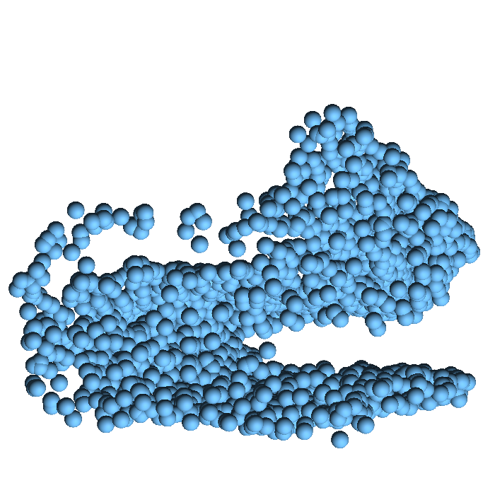
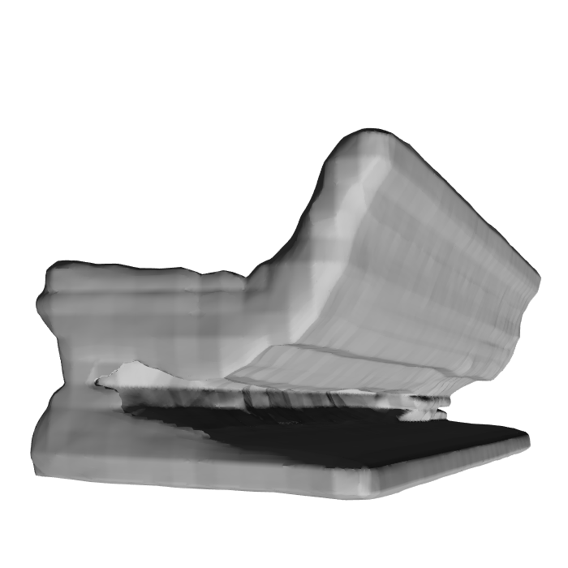
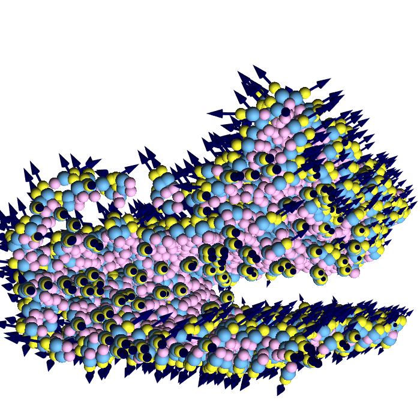
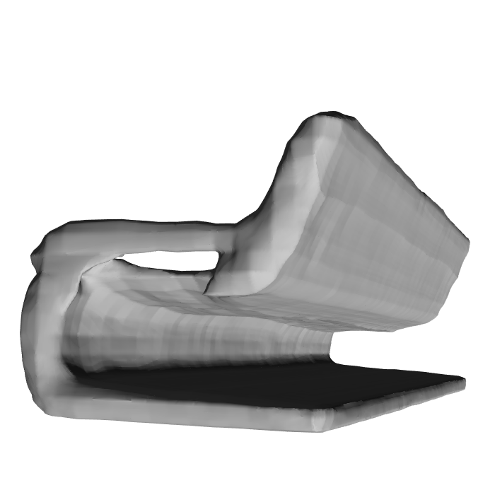

# Deep Surface Reconstruction from Point Clouds with Visibility Information


Data, code and pretrained models for the ICPR 2022 paper ([arXiv](https://arxiv.org/abs/2202.01810)).

<table>
<thead>
  <tr align="center">
    <th></th>
    <th></th>
    <th></th>
    <th></th>
  </tr>
</thead>
<tbody align="center">
  <tr>
    <td>Point cloud</td>
    <td>Reconstruction</td>
    <td>Point cloud with Visibility</td>
    <td>Reconstruction</td>
  </tr>
</tbody>
</table>

## Data

### ModelNet10

- The ModelNet10 models made watertight using [ManifoldPlus](https://github.com/hjwdzh/ManifoldPlus)
can be downloaded [here on Zenodo](https://zenodo.org/record/5920479#.YflZilvMLIE).
- The ModelNet10 scans used in our paper can be downloaded
[here on Zenodo](https://zenodo.org/record/5940164#.YflZolvMLIE). The dataset also includes training and evaluation
data for ConvONet, Points2Surf, Shape As Points, POCO and DGNN.

### ShapeNet*v1* (13 class subset of [Choy et al.](https://arxiv.org/abs/1604.00449))

- The watertight ShapeNet models can be downloaded [here](https://s3.eu-central-1.amazonaws.com/avg-projects/occupancy_networks/data/watertight.zip) (provided by the authors of [ONet](https://arxiv.org/abs/1812.03828)).
- Please open an issue if you are interested in the scans used in our paper.

### Synthetic Rooms Dataset

- The watertight scenes can be downloaded [here](https://s3.eu-central-1.amazonaws.com/avg-projects/convolutional_occupancy_networks/data/room_watertight_mesh.zip) (provided by the authors of [ConvONet](https://arxiv.org/abs/2003.04618)).
- Please open an issue if you are interested in the scans used in our paper.

[//]: # (- The training and evaluation data for ConvONet can be downloaded here.)

[//]: # (- The training data for Shape As Points can be downloaded here.)

### Scanning Procedure

You can create point clouds with visibility information of your own dataset using the `scan` tool. 
You can use the precompiled `scan` executable from this repository (which should work on most Ubuntu systems),
or compile it youself using [mesh-tools](https://github.com/raphaelsulzer/mesh-tools).

```bash
./scan -w path/to/workingDir -i filenameMeshToScan --export npz
```

For creating the scans used in the paper the follwing settings were used:

```bash
--points 3000 --noise 0.005 --outliers 0.0 --cameras 10
```

### Data Loading

You can use the `dataloader.py` script to load visibility augmented point clouds from the `scan.npz` files.


## Code and Pretrained Models

You can find our modified code and pretrained models for the surface reconstruction methods tested in our paper below.
All methods support point clouds with and without visibility information.

- [ConvOnet](https://github.com/raphaelsulzer/convolutional_occupancy_networks)
- [Points2Surf](https://github.com/raphaelsulzer/points2surf)
- [Shape As Points](https://github.com/raphaelsulzer/shape_as_points)
- [POCO](https://github.com/raphaelsulzer/POCO)
- [LIG](https://github.com/raphaelsulzer/graphics)
- [DGNN](https://github.com/raphaelsulzer/dgnn)


## References

If you find the code or data in this repository useful, please consider citing

```bibtex
@INPROCEEDINGS{sulzer2022deep,
  author={Sulzer, Raphael and Landrieu, Loïc and Boulch, Alexandre and Marlet, Renaud and Vallet, Bruno},
  booktitle={2022 26th International Conference on Pattern Recognition (ICPR)}, 
  title={Deep Surface Reconstruction from Point Clouds with Visibility Information}, 
  year={2022},
  volume={},
  number={},
  pages={2415-2422},
  doi={10.1109/ICPR56361.2022.9956560}}
```


